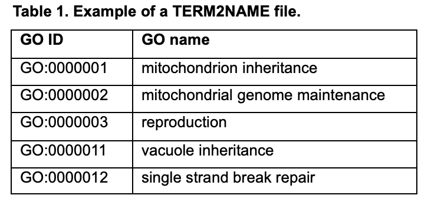
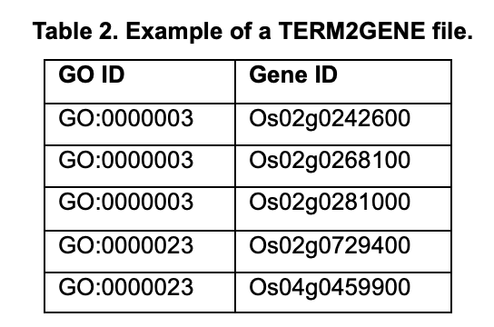
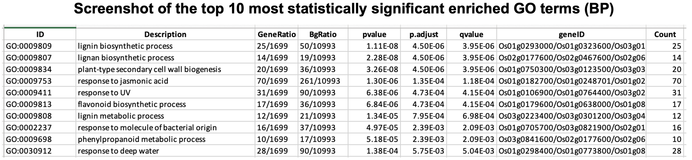
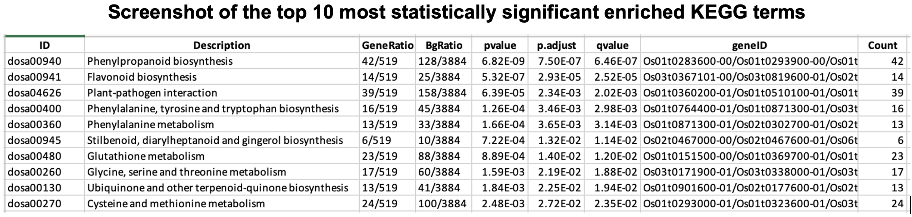
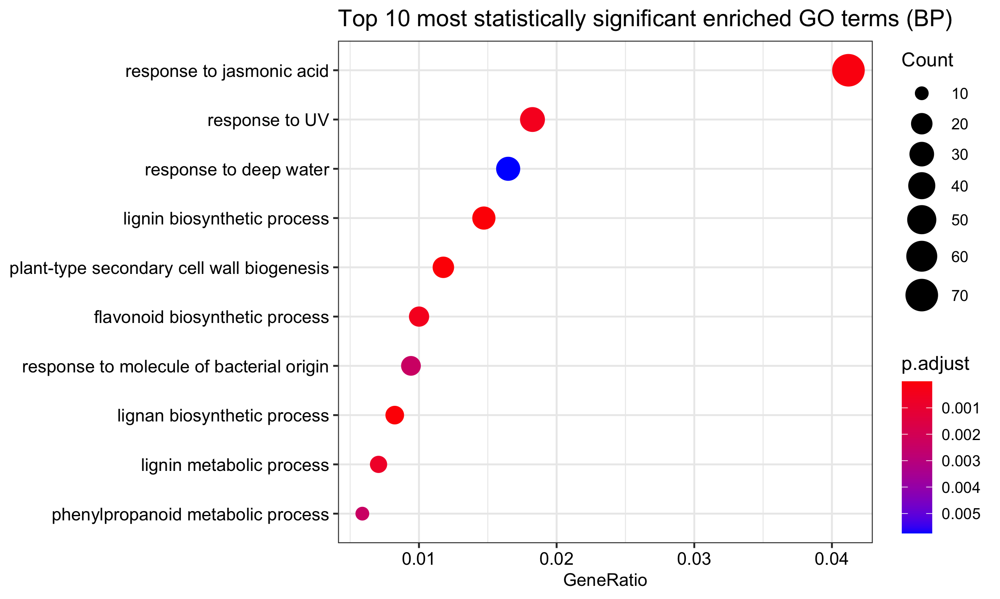
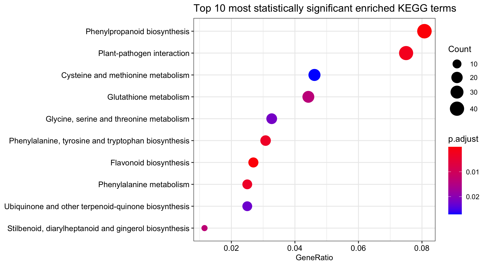

[](http://www.gnu.org/licenses/gpl-3.0)

# GO/KEGG Enrichment Analysis on Gene Lists from Rice (Oryza Sativa)

## Overview

This is a workflow for using clusterProfiler software to perform GO and KEGG enrichment analysis for gene lists from rice. The gene annotations are the key to these analyses. For GO annotaion, two types of sources are used here: 1. self-curated annotations derived from public rice databases, and 2. GO annotatons from a bioconductor package, AnnotationHub. For KEGG annotation, the gene annotation is directly retrieved from the KEGG database when using the clusterProfiler enrichment function.

## Introduction

RNA-seq data analysis has been streamlined, and functional enrichment analysis is a critical step to provide biological insights on the results. Enrichment analysis, or over-representative analysis, is to examine whether a gene ontology or a biological pathway is enriched in the target gene list more than is expected by chance. Many tools were developed to contain both annotation files and enrichment test functions to streamline this process. The statistical tests were universal among different enrichment tests, while the lacking the annotation files for species under-study could be an obstacle. For instance, only 20 GO annotation databases were available under OrgDb from Bioconductor, where only one is the plant species, Arabidopsis. In this protocol, I focus on performing functional enrichment analysis on genes from rice, a model organism for the grass family, using one of the most commonly used enrichment analysis R software clusterProfiler (Yu et al., 2012). I provide a step-by-step instruction covering the GO analysis using annotation information from two different sources, and KEGG analysis using the annotation from the KEGG database. The scripts were mainly R scripts, with some Bash command lines for curating a GO annotation file. 


## Installation

- __Running environment__: 
    - Part of the the workflow is Bash script that is run on the Linux system (Ubuntu 18.04.5 LTS). The rest are R scripts which are run in RStudio (1.4.1717) on the macOS system.

- __Required R software and versions__: 
    - [clusterProfiler 3.16.1](https://guangchuangyu.github.io/software/clusterProfiler/documentation/)
    - [GO.db 3.11.4](https://bioconductor.org/packages/release/data/annotation/html/GO.db.html)
    - [AnnotationHub 2.20.1](https://bioconductor.org/packages/release/bioc/vignettes/AnnotationHub/inst/doc/AnnotationHub.html)
    - [dplyr 1.0.7](https://dplyr.tidyverse.org/)
    - [data.table 1.14.0](https://cran.r-project.org/web/packages/data.table/vignettes/datatable-intro.html)
    - [ggplot2 3.3.5](https://ggplot2.tidyverse.org/)

Install required R packages through Biocondutor. Skip the packages that have already been installed.

```
if (!require("BiocManager", quietly = TRUE))
  install.packages("BiocManager")
packages <- c("clusterProfiler", "GO.db", "AnnotationHub", "dplyr", "data.table", "ggplot2")
BiocManager::install(setdiff(packages, rownames(installed.packages())))
```


## Input Data

1.	Target gene list (genes.txt), background gene list (bkgd.txt, optional but recommended). The gene IDs are the RAP IDs in this protocol, e.g. Os01g0102500, Os01g0106300. See the /input folder.
2.	The gene annotation file obtained from The Rice Annotation Project (RAP) Database (RAP-DB), including both the GO annotation information and RAP gene ID to RAP transcript ID conversion information. [Link.](https://rapdb.dna.affrc.go.jp/download/archive/irgsp1/IRGSP-1.0_representative_annotation_2021-11-11.tsv.gz) 
3.	The gene annotation file from the OryzaBase website. [Link.](https://shigen.nig.ac.jp/rice/oryzabase/download/gene)
4.	RAP ID to Entrez ID conversion table from the He Lab at Fujian Agriculture and Forestry University, China. [Link.](http://bioinformatics.fafu.edu.cn/riceidtable/)


## Major steps

#### Step 1: GO enrichment analysis using annotations from self-curated annotation files

- 1.1 Prepare rice gene GO annotation files using public annotation databases. (Step 1.a in the protocol)

Run the command in Linux.
```
sh workflow/1_curate_rice_GO_annotation.sh
```

After this step, work on a local computer and run the following scripts in R. Also, create two new folders: data and output. data: to save intermediate result files. output: to save the final files. Save the files from Step 1 into the data folder. 

- 1.2 Prepare self-provided GO annotations for clusterProfiler function. (Step 1.b in the protocol)

```
source("workflow/2_prep_GO_annotation_files.R")
```

Here are the resulting GO annotation files, TERM2NAME (optional but highly recommended), and TERM2GENE (required).

<p float="left">
  
   
</p>


- 1.3 Run universal enrichment function, enricher. (Step 1.c and 1.d in the protocol)

```
source("workflow/3_run_enricher.R")
```

#### Step 2: GO enrichment analysis using annotations from AnnotationHub package

```
source("workflow/4_run_enrichGO.R")
```

#### Step 3: KEGG enrichment analysis using annotations from KEGG database

```
source("workflow/5_run_enrichKEGG.R")
```

## Expected results

With the input gene lists, twenty-nine GO terms were enriched in the GO enrichment analysis using the self-curated annotation files, while none when using annoations from the AnnotationHub package. And eleven KEGG terms were enriched in the KEGG enrichment analysis using the annotation from the KEGG database. The result tables of the enriched GO/KEGG terms are in the /output folder, and the screenshots of the tables are shown below. The top 10 most statisitcally significant enriched GO and KEGG terms are visualized by dot plots, which are saved in the /figures folder and are shown below.


<p float="center">
  
    
  
   
</p>


## License
This code is free and open source, licensed under [GPLv3](https://github.com/github/choosealicense.com/blob/gh-pages/_licenses/gpl-3.0.txt).
